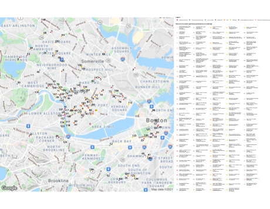

## December 2021

### [Create Static Maps with R](https://gmelloni.github.io/blog/cambridge_homelessness.html)

A tutorial on how to transform any interactive 
My Google Map into static printable maps with ggmap. 

In this example, we will convert the 
[Cambridge Resources for People Experiencing Homelessness](https://www.google.com/maps/d/u/0/viewer?mid=1IqJfrCiNpjzX4qajcFOExhN3nRm_ZSeq&ll=42.37703477815819%2C-71.15098675&z=12) 
into a simple, foldable map that any person without a smartphone can check.

It was inspired by the amazing person 
that created the map in the first place, so thank you Eva Rachel :)

----------------------

