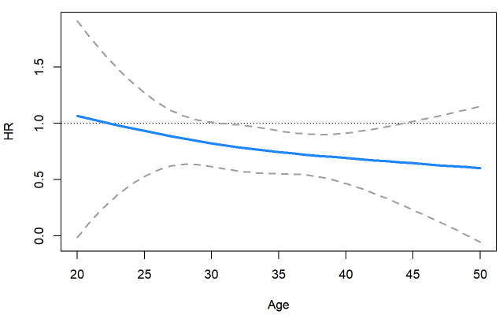
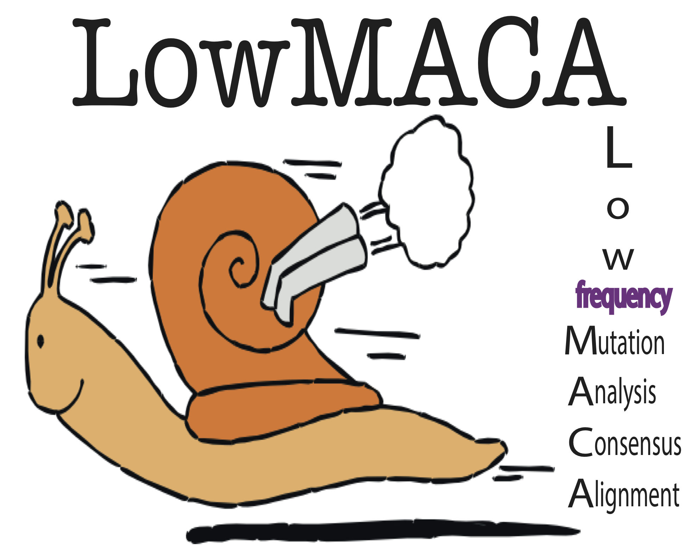
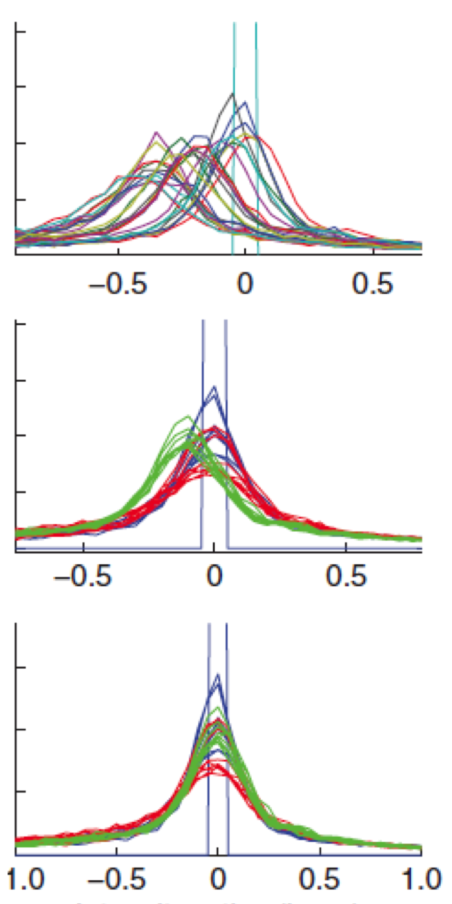
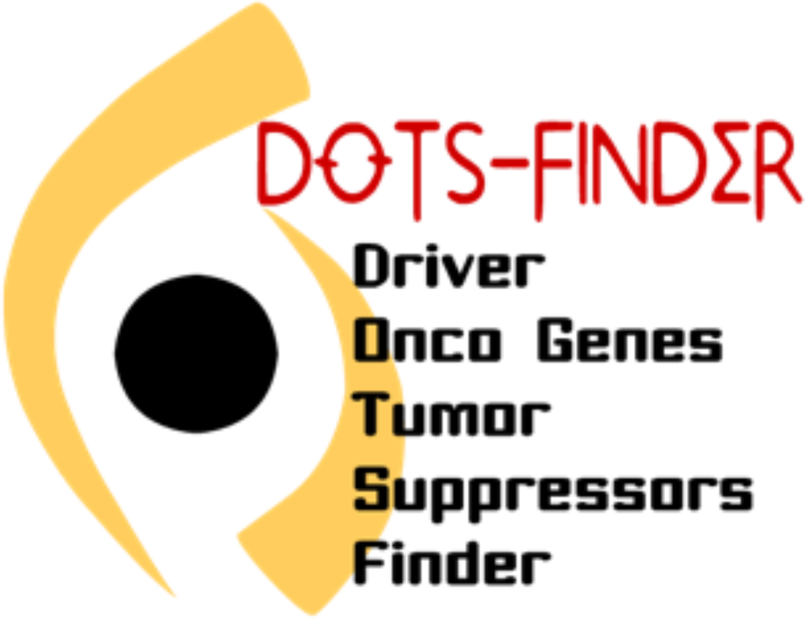

### [interactionHR](https://github.com/gmelloni/interactionHR)

<div style="text-align:center">
<a href="https://github.com/gmelloni/interactionHR">

</a>
</div>

```
interactionHR is an R package to estimate hazard ratios 
of a variable change when interacting with another variable.
Simple interaction Cox models and restricted cubic spline are implemented.
Confidence interval can be calculated via delta method or bootstrap.
```


----------------------

### [Precision Trial Drawer](https://gmelloni.github.io/ptd)

<div style="text-align:center">
<a href="https://gmelloni.github.io/ptd">

</a>
</div>

```
PTD provides a series of tools that can help bioinformaticians, 
clinicians and biostatisticians to design, analyze and finalize 
custom gene panels for cancer genomics clinical trials.
```


----------------------

### [LowMACA](http://cgsb.genomics.iit.it/wiki/projects/LowMACA)

<div style="text-align:center">
<a href="http://cgsb.genomics.iit.it/wiki/projects/LowMACA">

</a>
</div>

```
LowMACA is a method able to assess specific characteristics of rarely 
mutated genes that show patterns of positive selection by aggregating 
mutational patterns of several genes that have a high level of sequence similarity 
```

Available on [Bioconductor](http://www.bioconductor.org/packages/release/bioc/html/LowMACA.html)!

**Melloni GE**, de Pretis S*, Riva L, Pelizzola M, Céol A, Costanza J, Müller H, Zammataro L 
[LowMACA: exploiting protein family analysis for the identification of rare driver mutations in cancer.](https://bmcbioinformatics.biomedcentral.com/articles/10.1186/s12859-016-0935-7) 
BMC Bioinformatics. 2016 Feb 9;17(1):80. doi: 10.1186/s12859-016-0935-7.

----------------------

### [TransformPhenotype](https://github.com/gmelloni/transformPhenotype)

<div style="text-align:center">
<a href="https://github.com/gmelloni/transformPhenotype">

</a>
</div>
<br>
```
A shiny app to normalize continuous traits in Genome-wide 
association studies
```

Gilly A, Kuchenbaecker K, Southam L, Suveges D, Moore R, Melloni G, Hatzikotoulas K, Farmaki AE, Ritchie G, Schwartzentruber J, Danecek P, Kilian B, Pollard M, Ge X, Elding H, Astle W, Jiang T, Butterworth A, Soranzo N, Tsafantakis E, Karaleftheri M, Dedoussis G, Zeggini E [Very low depth whole genome sequencing in complex trait association studies](https://www.biorxiv.org/content/early/2017/07/28/169789), bioRxiv (2017) doi: https://doi.org/10.1101/169789 )

<!-- [](https://github.com/gmelloni/transformPhenotype) -->


----------------------

### [DOTS-Finder](http://cgsb.genomics.iit.it/wiki/projects/DOTS-Finder)

<div style="text-align:center">
<a href="http://cgsb.genomics.iit.it/wiki/projects/DOTS-Finder">

</a>
</div>
<br>
```
Driver Oncogenes and Tumor Suppressors finder is a tool 
to identify driver genes from exome-sequencing data 
from a cohort of cancer samples.
```

Available on [SourceForge](https://sourceforge.net/projects/dotsfinder/)

**Melloni GEM**, Ogier AGE, de Pretis S, Mazzarella L, Pelizzola M, Pelicci PG and Riva L. 
[DOTS-Finder: a comprehensive tool for assessing driver genes in cancer genomes.](https://genomemedicine.biomedcentral.com/articles/10.1186/gm563) 
Genome Medicine 2014, 6:44, DOI: 10.1186/gm563