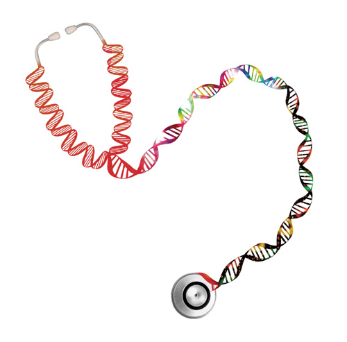

<link rel="icon" type="image/ico" href="images/ptd2.png"/>

------------------

<div class="row">
<div class="col-sm-9">

### Why PTD?

In the era of personalized medicine and personalized 
health there is a tremendous effort to bring NGS based 
technology in the clinical routine. Nevertheless, 
genome-wide information from research studies is in most 
cases useless in the clinical practice and in addition 
too expensive. 

To bridge the gap between cancer research 
and clinical genomics, we propose **PrecisionTrialDesigner**, 
a suite of tools to explore the ability of cancer gene panels 
to be used in clinical trials.

</div>
<div class="col-sm-3">

```{r, out.width = "250px" , echo=FALSE , fig.align='center'}

```

</div>
</div>

### What can you do with PTD?

```{r, out.width = "400px" , echo=FALSE , fig.align='center'}
knitr::include_graphics("images/conclusionSlide2.jpg")
```

<div class="row">
<div class="col-sm-6">

#### Data

Design your panel and link it to specific tumor types

* Create a **Cancer Panel** linking drugs to specific genes or alterations
* Integrate genomic data like mutations, expression, copynumber and fusions
* Use data from over **40 tumor types**

</div>
<div class="col-sm-6">

#### Simulation

Calculate various measure of **study feasibility**

* How many patients are covered by a specific mutations? 
* How many patients would be covered by a drug that acts on one or multiple targets?
* Are the drugs covering overlapping pathways?

</div>
</div>

-----------------------

<div class="row">
<div class="col-sm-6">

#### Power Analysis

Assure **high power** minimizing the number of 
patients to screen.

* Innovative sample size calculation designed for genomic-driven clinical trials
* Calculate sample size for a basket or umbrella trial with multiple drugs or tumor types
* Given a power level to reach, analyze various simulation scenarios

</div>
<div class="col-sm-6">

#### Panel Design

Happy with the **panel design**?

* Adjust gene size choosing what sequences to include
* Compare covered patients VS sequencing size
* Create a ready-to-sequence panel in bed format

</div>
</div>